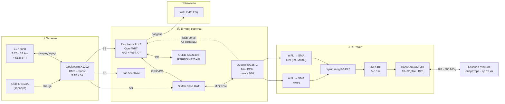

# LTE-коробка с параболиком — спецификация, схема, автономность

Портативный 4G-роутер. Внутри — модем + одноплатник на OpenWRT + батарея. Снаружи — параболик MIMO 2×2, заведённый коаксом через гермоввод. Лочка на Band 20 (800 МГц) ради дальнобойности и устойчивости связи. Дальность линка до 15 км по прямой видимости при «жирном» секторе оператора.

> Файл — рабочий черновик. Цифры по потреблению — типовые из даташитов, не из живого замера. При сборке прототипа надо замерить мультиметром и обновить таблицу.

---

## 1. Спецификация — узлы и конкретные позиции

### 1.1. Модем (сердце линка)

| Что | Конкретно | Почему | Цена | Где | Документация |
|---|---|---|---|---|---|
| LTE-модуль | **Quectel EG25-G** (Mini PCIe) | LTE Cat 4 (150/50 Мбит/с), MIMO 2×2, все мировые бэнды включая B20, GNSS, поддержка AT-лочки бэнда | $55–80 (AliExpress), $90–120 (Sixfab/Mouser) | Sixfab, Mouser, Aliexpress | «EG25-G Hardware Design» PDF от Quectel; «EC25/EG25 AT Commands Manual» |
| Носитель модуля | **Sixfab 3G/4G/LTE Base HAT** (для Raspberry Pi) | Mini PCIe → USB-хост Pi, выводы u.FL для MAIN и DIV (готовое MIMO), SIM-слот, отдельный JST под доппитание модема | $60–80 | sixfab.com | Схемы и Gerber: github.com/sixfab/Sixfab_PiBaseHat |
| SIM | nano-SIM оператора с покрытием B20 | — | — | — | — |

**Лочка на Band 20** (после `picocom /dev/ttyUSB2`):
```
AT+QCFG="nwscanmode",3,1     # только LTE
AT+QCFG="band",0,0x80000,0,1 # маска LTE = bit 19 = только B20
AT+CFUN=1,1                  # рестарт модема
```
Маску бэнда проверять по «EC25&EG25 AT Commands Manual», глава QCFG — формат `(gsmbandval, ltebandval, tdsbandval, effect)`.

### 1.2. Вычислитель + WiFi (OpenWRT)

| Вариант | Плюсы | Минусы | Цена |
|---|---|---|---|
| **Raspberry Pi 4B 2 GB** (рекомендую для старта) | Огромное комьюнити, готовые OpenWRT-сборки, простая отладка | Ест 0.6–1.2 А, греется | $45 |
| Альтернатива: **NanoPi R4S** или **R5S** | Заточен под роутер, два Ethernet, тише и холоднее, ~0.3–0.5 А | Дороже, меньше готовых HAT под него | $60–90 |

Прошивка OpenWRT под Pi: форк **geerlingguy/pi-router** на GitHub — сборка с поддержкой 4G-модема, по умолчанию роутер на 192.168.1.1. Под NanoPi — официальные образы FriendlyWrt.

### 1.3. Питание (батарея + BMS + boost + power-path)

| Вариант | Состав | Ёмкость | Выход | Цена |
|---|---|---|---|---|
| **Geekworm X1202** (рекомендую) | 4× 18650, BMS, USB-C in, power-path | 14 000 мА·ч @ 3.7 В = **51.8 Вт·ч** | 5.1 В / 5 А | $25–30 + батареи |
| Waveshare UPS HAT (E) | 2× 18650, INA219 для I²C-телеметрии | 7 000 мА·ч = 25.9 Вт·ч | 5 В / 3 А | $25 |
| Самосбор | TP4056 (заряд) + MT3608 (boost) + IRF9540 power-path | по числу банок | до 2 А | $5 за плату |

**Батареи:** Samsung INR18650-35E (3500 мА·ч, 8 А разряд) — у официальных дилеров. На AliExpress «UltraFire 9900 mAh» — мусор, реально 1500–2000.

**Почему нужно ≥5 А:** пиковый ток EG25-G в 2G-всплеске доходит до 2 А, плюс Pi под нагрузкой 1.2 А, плюс WiFi 0.3 А. Слабая плата просядет и модем уйдёт в ребут.

### 1.4. RF-тракт

| Что | Конкретно | Цена |
|---|---|---|
| Пигтейлы | 2× u.FL → SMA female (20 см, RG-178) | $5 ×2 |
| Внешняя антенна | **Poynting MIMO-4-V2-15** (направленный MIMO-патч, ~10 дБи, B20) — или **RFelements UltraDish TP 5-30** + два LTE-облучателя на 800 МГц для настоящего параболика | $200–400 |
| Кабель | LMR-400 5–10 м с SMA male на обоих концах | $30–60 |
| Гермоввод | PG13.5 кабельный сальник под Ø10 мм | $2 |

Главная (MAIN) — приём+передача, диверсити (DIV) — только приём, это и есть MIMO 2×2.

### 1.5. Охлаждение

| Что | Зачем |
|---|---|
| Радиатор на CPU Pi + 30 мм 5В вентилятор | Pi 4 троттлит без активного охлаждения под нагрузкой |
| Алюминиевый радиатор на экран EG25-G | Quectel прямо требует теплоотвод в даташите |

### 1.6. Корпус + телеметрия наведения

| Что | Конкретно |
|---|---|
| Корпус | ABS IP65, 200×150×100 мм, с гермовводом под антенный коакс |
| Дисплей телеметрии | 0.96" OLED SSD1306 I²C ($4) — показывает RSRP/RSRQ/SINR/% батареи, чтобы крутить параболик и видеть, куда «потеплело» |
| Кнопка/LED | Тумблер питания + status LED на крышке |

**Скрипт телеметрии** на OpenWRT: раз в секунду опрашивает `AT+QCSQ` (RSSI/RSRP/SINR/RSRQ) через `/dev/ttyUSB2`, читает INA219 по I²C для процента батареи, рисует на OLED. Без этого узкий луч параболика не навести.

---

## 2. Блок-схема



---

## 3. Расчёт автономности

### 3.1. Потребление по узлам (типовые числа из даташитов)

| Узел | Idle | Типично | Пик |
|---|---:|---:|---:|
| Raspberry Pi 4 + WiFi AP | 0.60 А | 0.90 А | 1.40 А |
| Quectel EG25-G (через USB 5В) | 0.05 А | 0.35 А | 2.00 А* |
| Вентилятор 30 мм 5В | 0.08 А | 0.08 А | 0.10 А |
| OLED SSD1306 | 0.02 А | 0.02 А | 0.02 А |
| **Итого @ 5В** | **0.75 А (3.8 Вт)** | **1.35 А (6.8 Вт)** | **3.5 А (17.5 Вт)** |

\* Пик модема — короткий 2G-burst, длительность миллисекунды, на средний расход почти не влияет, но требует, чтобы блок питания мог его выдать без просадки.

### 3.2. Доступная энергия

| Параметр | Значение |
|---|---|
| Батарея 4× 18650 INR-35E | 14 000 мА·ч × 3.7 В = **51.8 Вт·ч** |
| Минус потери BMS (~5%) | 49.2 Вт·ч |
| Минус КПД boost-преобразователя (~88%) на 5В | **≈ 43.3 Вт·ч** доступно на 5В-рейле |

### 3.3. Время работы

| Сценарий | Нагрузка | Автономность |
|---|---:|---:|
| Линк держится, трафика нет (idle) | 3.8 Вт | **≈ 11.4 часа** |
| Типичный браузинг / VPN / средний трафик | 6.8 Вт | **≈ 6.4 часа** |
| Тяжёлая нагрузка (видеостриминг, бэкап) | 9.0 Вт | **≈ 4.8 часа** |
| Худший случай (всё одновременно) | 12 Вт | **≈ 3.6 часа** |

### 3.4. Время зарядки от USB-C (15 Вт, 3 А)

51.8 Вт·ч / 15 Вт = **≈ 3.5 часа** до полной (на практике 4–5 часов с учётом CC/CV-фазы).

### 3.5. Если нужно больше автономности

- Заменить Pi 4 на **NanoPi R4S** → minus ~0.4 А → +40% времени работы.
- Добавить ещё 4× 18650 параллельно (плата на 8 банок) → +100% к ёмкости, +0.5 кг к весу.
- В дороге зарядка от **PD-павербанка 100 Вт·ч** — даст ещё одну полную перезарядку.

---

## 4. Что собрать дальше (после согласования железа)

1. **BOM-таблица в XLSX** с конкретными SKU, ссылками и итоговой ценой.
2. **Прошивка OpenWRT** — список пакетов (`luci-proto-modemmanager`, `modemmanager`, `usb-modeswitch`), конфиг `/etc/config/network` под EG25-G через ModemManager.
3. **Скрипт телеметрии** (Python или Lua) для OLED + лога RSRP в файл — для последующей подстройки антенны.
4. **Чертёж укладки в корпусе** (схематично) — куда что поместится, как разнести RF и питание, чтобы не наводить шум на модем.

---

## 5. Открытые вопросы

- Точная **модель параболика/направленной антенны** под B20 (есть бюджет/предпочтения по производителю?).
- **Где собирать** — самим в дерево или есть знакомый паяльщик?
- Нужна ли **GNSS** (модем умеет, но требует отдельную активную антенну) — для логирования позиции при выезде на точку?
- **Сертификация/легальность** — для коммерческого использования направленного усиления может потребоваться согласование с оператором (повышенный EIRP в его сторону).
